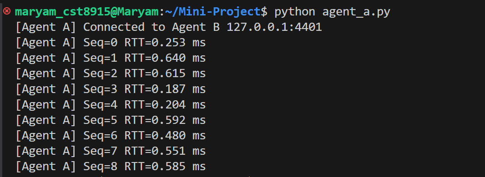
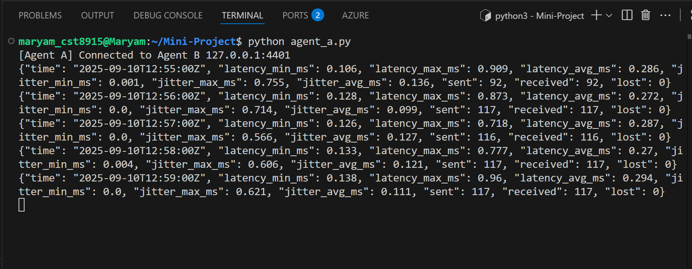

# Mini Project (TCP Edition)

## Step 1: TCP Echo Test

This is the first step of the **Mini Project**.  
It demonstrates a basic **TCP echo test** between two agents:

- **Agent B (server)**: Listens on port `4401` and echoes back whatever it receives.
- **Agent A (client)**: Sends JSON probe packets, receives echoes, and measures **round-trip time (RTT)**.


##  Screenshots

### Agent B (Server)


### Agent A (Client)


---

---

##  What We Achieved
- Established a persistent **TCP connection** between Agent A and Agent B.
- Implemented a simple **echo server**.
- Measured **RTT (latency)** for each probe.

---

## Step 2 — Per-Minute Aggregation

**Goal:**Agent A measures RTT (A→B→A), computes loss (2s timeout), and jitter (successive RTT delta) over 1-minute tumbling windows.

##  Screenshots
### Agent A (Client)


## Step 3 — MQTT Integration

**Goal:** Agent A publishes per-minute stats to MQTT; Agent B subscribes.

- Agent A publishes to:  
  `netstats/<agent_id>/minute`
- Agent B subscribes to:  
  `netstats/+/minute`

### Setup

Install requirements:
```bash
pip install -r requirements.txt
```

Start Mosquitto broker:
```bash
sudo systemctl start mosquitto
```
## step 4 - SQLite persistence
   - Agent B inserts aggregates into SQLite with UPSERT.  
   - Validated rows persisted correctly.

## step 5 - Web Visualization**  
   - Built Flask endpoint `/api/series`.  
   - Created Chart.js frontend with toggle controls.  
   - Added auto-refresh (15s) to keep chart live.
   
###  How to Run

1. Clone repo and set up venv:
   ```bash
   git clone https://github.com/MaryamKhalaf2010/Mini-Project
   cd Mini-Project
   python3 -m venv .venv
   source .venv/bin/activate
   pip install -r requirements.txt
   ```

2. Start local MQTT broker (e.g., `mosquitto` on port 1883).

3. Run Agent B (echo + subscriber + SQLite):
   ```bash
   python agent_b.py
   ```

4. Run Agent A (probe + metrics + publisher):
   ```bash
   python agent_a.py
   ```

5. Run Flask web app:
   ```bash
   python app.py
   ```

6. Open browser at `http://localhost:5000` to view charts.

# Mini Project (UDP Edition)
Teach networking (UDP echo), timing/metrics (latency, jitter, loss), pub/sub (MQTT), persistence (SQLite), and simple data viz (HTML chart). Targeted for **Python 3.11 on WSL Ubuntu 22.04+** with `venv`.

---

## Overview
- **Agent A** sends small JSON probe packets via **UDP** to **Agent B** at a fixed rate (default 2 Hz). It measures **RTT**, computes **jitter** and **loss** in **1‑minute tumbling windows** aligned to the wall clock minute. After each minute (+2s grace), Agent A publishes an aggregate JSON to **MQTT**.
- **Agent B** runs a stateless **UDP echo** server (returns the exact bytes) and an **MQTT subscriber** that persists minute aggregates to **SQLite**.
- A tiny **Flask** API exposes `/api/series` for the HTML viewer (**Chart.js**) to plot latency, jitter, and loss over time.

---


- **UDP echo**: one datagram in → the same datagram out. No parsing on the echo path.
- **Minute finalize**: done at **minute_end + TIMEOUT_S** (default 60s + 2s) to capture all on‑time echoes.

---

## Data & Metrics

### Probe (UDP payload)
```json
{
  "agent_id": "<uuid4>",
  "seq": 123,                 // uint16, wraps at 65535
  "t_send_ns": 1234567890     // time.monotonic_ns()
}
```
Agent B echoes bytes verbatim. Agent A computes:
- **RTT (ms)** = `(recv_monotonic_ns - t_send_ns) / 1e6`.
- **Jitter (ms)** = `abs(rtt[i] - rtt[i-1])` within the same minute.
- **Loss (Option A)** = `sent - received` at finalize (on‑time receive = RTT ≤ TIMEOUT_S).

### MQTT minute aggregate
Topic: `netstats/<agent_id>/minute` (QoS 0, retain false)
```json
{
  "agent_id": "f9a5d0ac-7d7a-4a56-96a1-a0f93d9f5b3d",
  "time": "2025-09-09T12:34:00Z",
  "latency_min_ms": 1.8,
  "latency_max_ms": 6.2,
  "latency_avg_ms": 2.4,
  "jitter_min_ms": 0.0,
  "jitter_max_ms": 1.9,
  "jitter_avg_ms": 0.6,
  "sent": 120,
  "received": 118,
  "lost": 2
}
```

---

## Components

### Agent A (UDP probe + metrics + MQTT publisher)
- Sends UDP probes to `HOST:PORT` at `RATE_HZ` (default 2/s).
- Tracks outstanding probes in `in_flight` for RTT computation.
- Aggregates per‑minute latency/jitter.
- **Loss** computed at finalize: `lost = sent - received` (after +2s grace).
- Publishes minute JSON to MQTT.

**Run:**
```bash
python agent-a-udp.py
```

### Agent B (UDP echo + MQTT→SQLite)
- UDP server on `0.0.0.0:4401`: echoes back bytes (`recvfrom` → `sendto`).
- MQTT subscriber on `netstats/+/minute`: upsert rows into SQLite.

**Run:**
```bash
python agent-b-udp.py
```

### Viewer (Flask API + HTML chart)
- `app.py` serves `index.html` and `/api/series` from `netstats.db`.
- `index.html` uses Chart.js (via CDN) to plot latency, jitter, and loss.
- Time scale x‑axis; you can toggle each series. Lost can be a line.

**Run:**
```bash
pip install flask
python app.py
# open http://127.0.0.1:5000
```

---

## Install & Run

### 0) Prereqs (WSL Ubuntu 22.04+)
```bash
sudo apt update
sudo apt install -y python3.11 python3.11-venv sqlite3 mosquitto mosquitto-clients
```

### 1) Create venv
```bash
cd ~/Mini-Project
python3.11 -m venv .venv
source .venv/bin/activate
pip install --upgrade pip
```

### 2) Python deps
```bash
pip install paho-mqtt flask
```

### 3) Start MQTT broker
```bash
sudo service mosquitto start
# test (optional): mosquitto_sub -t 'netstats/#' -v
```

### 4) Run processes
Open 3 terminals (same venv):
```bash
# T1: Agent B (echo + DB writer)
python agent-b-udp.py

# T2: Agent A (sender + metrics + publisher)
python agent-a-udp.py

# T3: Viewer API + dashboard
python app.py
# then open http://127.0.0.1:5000
```

the SQLite DB (`netstats.db`) will fill with 1 row per minute per agent. The dashboard queries the DB via `/api/series` and draws the chart.

---

### created by Maryam Khalaf