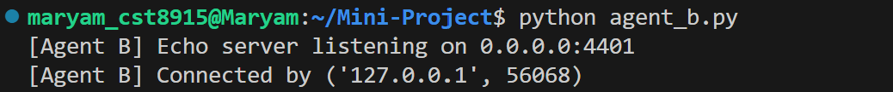

# Mini Project 

## Step 1: TCP Echo Test

This is the first step of the **Mini Project**.  
It demonstrates a basic **TCP echo test** between two agents:

- **Agent B (server)**: Listens on port `4401` and echoes back whatever it receives.
- **Agent A (client)**: Sends JSON probe packets, receives echoes, and measures **round-trip time (RTT)**.


##  Screenshots

### Agent B (Server)


### Agent A (Client)


---

---

##  What We Achieved
- Established a persistent **TCP connection** between Agent A and Agent B.
- Implemented a simple **echo server**.
- Measured **RTT (latency)** for each probe.

---

## Step 2 — Per-Minute Aggregation

**Goal:**Agent A measures RTT (A→B→A), computes loss (2s timeout), and jitter (successive RTT delta) over 1-minute tumbling windows.

##  Screenshots
### Agent A (Client)


## Step 3 — MQTT Integration

**Goal:** Agent A publishes per-minute stats to MQTT; Agent B subscribes.

- Agent A publishes to:  
  `netstats/<agent_id>/minute`
- Agent B subscribes to:  
  `netstats/+/minute`

### Setup

Install requirements:
```bash
pip install -r requirements.txt
```

Start Mosquitto broker:
```bash
sudo systemctl start mosquitto
```
## step 4 - SQLite persistence
   - Agent B inserts aggregates into SQLite with UPSERT.  
   - Validated rows persisted correctly.

## step 5 - Web Visualization**  
   - Built Flask endpoint `/api/series`.  
   - Created Chart.js frontend with toggle controls.  
   - Added auto-refresh (15s) to keep chart live.
   
###  How to Run

1. Clone repo and set up venv:
   ```bash
   git clone https://github.com/MaryamKhalaf2010/Mini-Project
   cd Mini-Project
   python3 -m venv .venv
   source .venv/bin/activate
   pip install -r requirements.txt
   ```

2. Start local MQTT broker (e.g., `mosquitto` on port 1883).

3. Run Agent B (echo + subscriber + SQLite):
   ```bash
   python agent_b.py
   ```

4. Run Agent A (probe + metrics + publisher):
   ```bash
   python agent_a.py
   ```

5. Run Flask web app:
   ```bash
   python app.py
   ```

6. Open browser at `http://localhost:5000` to view charts.